## Hey there 👋

I am Rishi, and I pretty much like working on anything under the sun, provided it's fun and difficult. I have worked across the machine learning stack and on several applied AI projects as well. I love exploring how far modern day LLMs can be pushed, and still believe we are only starting to scratch the surface on what these things are capable of.

In my free time I like reading sci-fi. Currently going through the Dungeon Crawler Carl series. Would love to have a chat if you are building anything cool around applied AI, LLM inference, and that sort of thing :)

<!--

-->

Since you're here anyway, might as well enjoy an xkcd, eh?

<!-- xkcd:start -->

*You might think most people you know are reliable voters, or that your nudge won't convince them, and you will usually be right. But some small but significant percentage of the time, you'll be wrong, and that's why this works.*

<!-- xkcd:end -->

<!--
**rdksupe/rdksupe** is a ✨ _special_ ✨ repository because its `README.md` (this file) appears on your GitHub profile.

Here are some ideas to get you started:

- 🔭 I'm currently working on ...
- 🌱 I'm currently learning ...
- 👯 I'm looking to collaborate on ...
- 🤔 I'm looking for help with ...
- 💬 Ask me about ...
- 📫 How to reach me: ...
- 😄 Pronouns: ...
- ⚡ Fun fact: ...
-->
